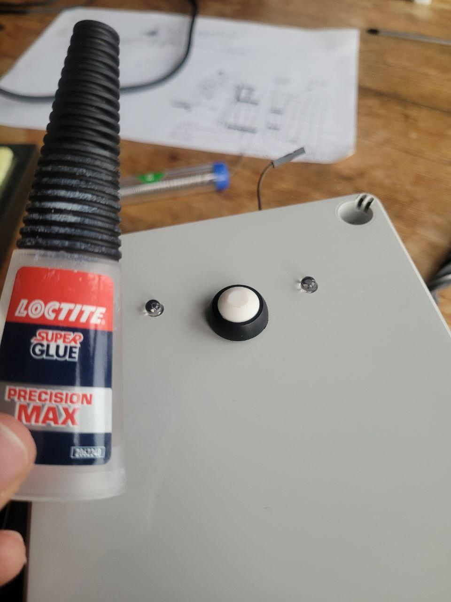
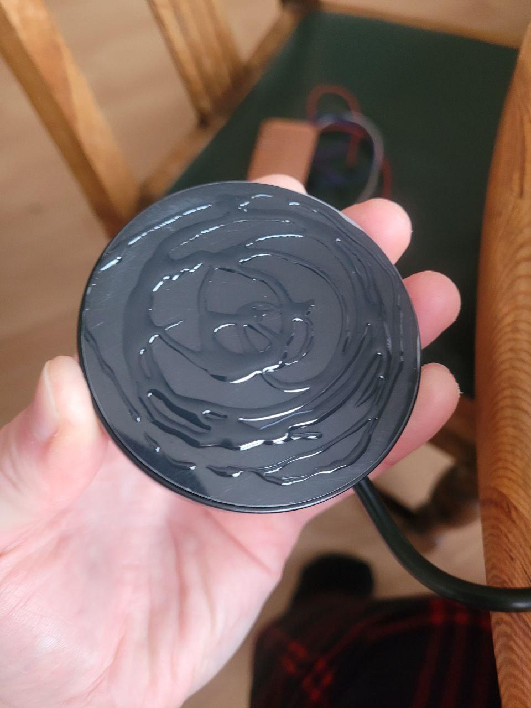
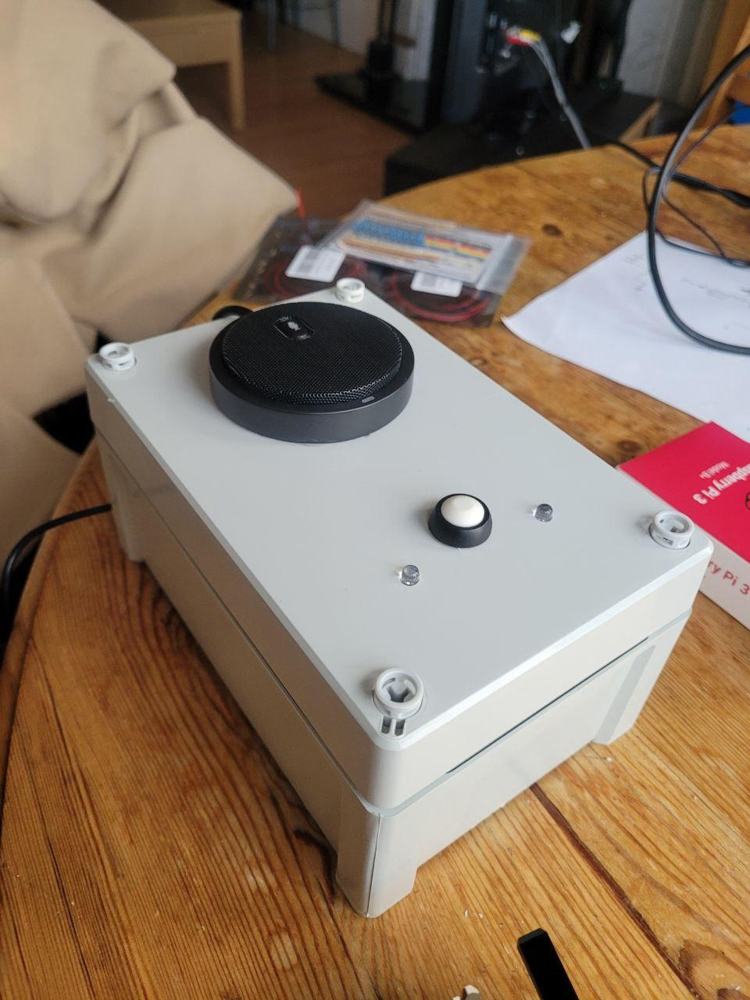

# Introduction

This repository contains all the instructions to create a CVR-SI device - a Conditional Voice Recorder for Sensitive Information. This work started with the original [CVR](https://github.com/MixedRealityLab/conditional-voice-recorder) as its foundation - please cite the following **TWO** papers if you use this device:

1. THE CVR-SI [paper](https://preview.aclanthology.org/emnlp-22-ingestion/2022.nlp4pi-1.3.pdf) published at EMNLP's Workshop on Natural Language Processing for Positive Impact titled "Securely Capturing People’s Interactions with Voice Assistants at Home: A Bespoke Tool for Ethical Data Collection" by Angus Addlesee:
```
@inproceedings{addlesee2022bespoke,
  title={Securely Capturing People’s Interactions with Voice Assistants at Home: A Bespoke Tool for Ethical Data Collection},
  author={Addlesee, Angus},
  booktitle={EMNLP's Workshop on Natural Language Processing for Positive Impact},
  year={2022}
}
```
2. The original CVR [paper](https://dl.acm.org/doi/pdf/10.1145/3173574.3174214) published at CHI titled "Voice Interfaces in Everyday Life" by Martin Porcheron, Joel Fischer, Stuart Reeves, and Sarah Sharples:
```
@inproceedings{porcheron2018voice,
  title={Voice interfaces in everyday life},
  author={Porcheron, Martin and Fischer, Joel E and Reeves, Stuart and Sharples, Sarah},
  booktitle={proceedings of the 2018 CHI conference on human factors in computing systems},
  pages={1--12},
  year={2018}
}
```

# Building the CVR-SI

Here you will find all the device component links, the full device construction guide, and the software.

## Links to All Required Components
In order to build the CVR-SI, you will need (quantity needed for ONE CVR-SI in brackets):
1. Drill with 5mm drill bit included (1): [LINK](https://amzn.to/3EQarzN)
2. 12mm drill bit (1): [LINK](https://amzn.to/3ufZCSF)
3. Device Case (1): [LINK](https://uk.rs-online.com/web/p/general-purpose-enclosures/0104155)
4. Soldering Iron (1): [LINK](https://amzn.to/3OSmXmL)
5. Circuit board holder (1): [LINK](https://amzn.to/3gLEDUv)
6. PCB Circuit Board (1): [LINK](https://amzn.to/3B14Lld)
7. 12mm Momentary Push Button (1): [LINK](https://amzn.to/3ub80mj)
8. F2M Breadboard Wires (5): [LINK](https://amzn.to/3gQzuuv)
9. Green 5mm LED with pre-attached resistor (1): [LINK](https://amzn.to/3Ujudt4)
10. Red 5mm LED with pre-attached resistor (1): [LINK](https://amzn.to/3gLvgEt)
11. 10k ohm resistor (1): [LINK](https://amzn.to/3AWJysP)
12. Raspberry Pi 3 Model B+ (1): [LINK](https://uk.rs-online.com/web/p/raspberry-pi/1373331) OR if out of stock as old model, [LINK to RPi 4](https://amzn.to/3Vmztxt)
13. Raspberry Pi Power Supply: [LINK](https://amzn.to/3AWWGOo) OR [supply for RPi 4](https://amzn.to/3gM5q30)
14. Glue (1): [LINK](https://amzn.to/3AXd15A)
15. Microphone (1): [LINK](https://amzn.to/3UkRudW)
16. SD Card (1): [LINK for 16Gb](https://amzn.to/3ViAwhZ) OR [LINK for 256Gb](https://amzn.to/3ir4dyt)
17. Screwdriver (1): [LINK](https://amzn.to/3VmduXj)
18. Optional Box for safe transport (1): [LINK](https://amzn.to/3VljtvC)


## Step-by-step Construction Guide (with photos)

Assuming you have all the materials listed above, you should be able to set out your table with them all:


First, you should use the drill with the 12mm drillbit to create a hole in the lid of the case. This hole will be for the button, you MUST do this and put the button in this whole BEFORE soldering. Once the button is soldered to the circuit board, it cannot fit through this hole:


You should also use the 12mm drill bit to make a large hole on the back of the CVR-SI case. This will let the power cable and microphone cable pass through (must be big enough for a USB cable to pass through):


Then you can switch the 12mm drill bit out for the 5mm drill bit. This is used to drill two smaller holes on either side of the button. Note again that the button is already in place:


Now it is time to plug in your soldering iron, wet its sponge, and gather the cables (note again that the button should already be in the lid - I took this photo earlier):


Get the circuit board and fit it in the circuit board holder. You can use the second 'claw' to hold the cable in place while you solder the cable end to the board:


Solder the board. I have created (with advice from Antero Duarte) two circuit diagrams. This one:


And the other is easier to read for those of you that are less familiar with electronics (the cells in the grid represent the holes in the circuit board):


To note, the Raspberry Pi pins are numbered in this diagram. The pins are numbered by the little circles, not the GPIO numbers. Source [here](https://www.raspberrypi.com/documentation/computers/raspberry-pi.html):


Once done, the resistor wires will need to be trimmed as they are quite long:


You should now have a fully soldered circuit board with the button through the hole in the lid:


Next we need to attach the correct cables to the correct Raspberry Pi pins (see the circuit diagram for the numbers):


The LEDs can now be fixed in place. Put a dab of glue on the bulb edge, and pop them in their holes. It does not matter whether the red or green LED is on the left or right:


While this is drying, we can get the software ready. Find the SD card of the desired size (16Gb or larger):


You can use any disc burning software, but I use balenaEtcher. Firstly, select the cvr-si.img to be burned on your SD card:


The software will be burned onto the SD card and then validated:


Once complete you can eject the SD card:


The SD can then be inserted into your Raspberry Pi:


We can now start to put everything together. Put the Raspberry Pi power cable in through the rear hole and into the Raspberry Pi:


Next, unbox the microphone, put the cable through the rear case hole, and plug it into the Raspberry Pi:


Apply a light layer of glue to the bottom of the microphone:


Hold microphone down. You will only have to do this for 1-2 mins and then you can let it go and let it set:


Pop the 'lugs' (I don't know the real name) into each corner of the CVR-SI:


You have to push these down quite hard. Each one should make a loud bang when clicking into place:


You can now screw the lugs to secure the lid in place:


And that's it! Your CVR-SI is complete:


## Img Files to Burn Your Own Device

- Available upon request as files are too large to host publicly (looking for solution).
